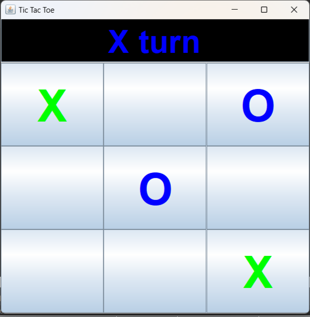
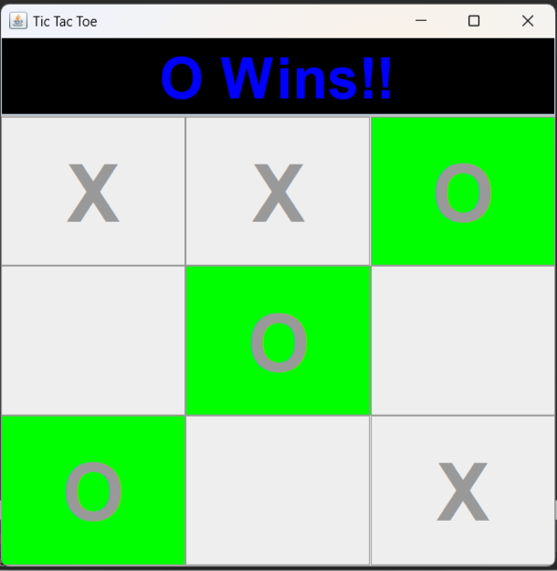

# Java-Projects
**Some simple java projects based on different concepts.**

# 1. Number Guessing Game
**It can be played in terminal.**

# 2. Sudoku Solver
**It can be used in terminal to solve valid sudoku box.**

# 3. Text Editor
**A GUI based text editor.**
**You can perform different tasks like saving, opening a file and changing the font color or size also.**

                

# 4. Simple Calculator
**A GUI based calcultor.**
**You can perform operations like addition, substraction, multiplication, division, etc.**

# 5. Tic Tac Toe
**A GUI based Tic Tac Toe Game.**

                               
